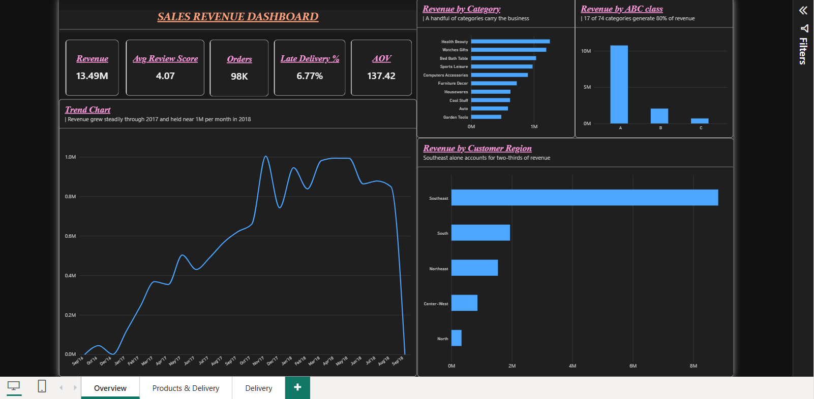
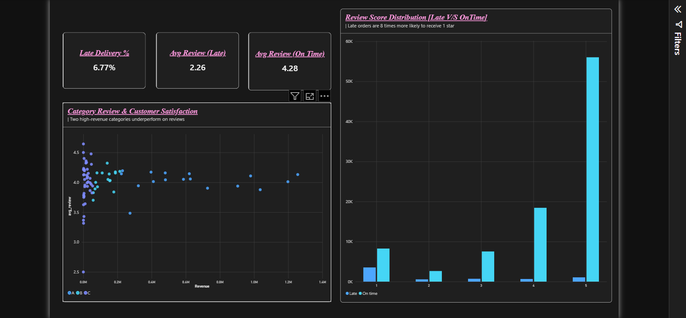
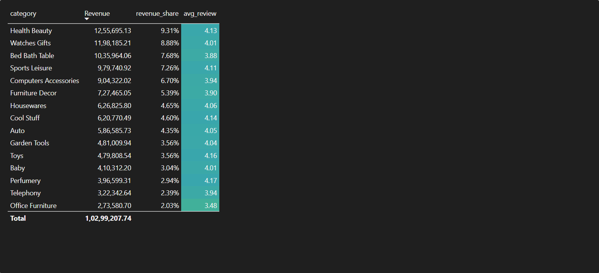

# Olist E-Commerce Analytics: Pipeline + Power BI Dashboard

End-to-end analysis of **99,441 orders** from Olist, a Brazilian online marketplace: a
tested Python pipeline that validates, models and analyses the data, plus a Power BI
dashboard built on its output.



## Headline findings

- **Revenue is concentrated in a quarter of categories.** 17 of 74 categories (23%)
  generate 80% of revenue. The long tail of 41 categories contributes around 5%.
- **Late delivery costs two full stars.** Orders delivered late average a 2.26 review
  score against 4.28 for on-time orders — and 54% of late orders leave one star, versus
  7% of on-time orders. Tested with Mann-Whitney U (p < 0.001, Cliff's delta 0.64).
- **The business has a retention problem.** Of 94,983 unique customers, only 2,887 (3%)
  ever ordered twice, making every sale dependent on paid acquisition.

Full write-up: [docs/analysis_report.md](docs/analysis_report.md)

## The questions this answers

1. How is revenue trending, and are we growing year on year?
2. Which categories drive most revenue, and which underperform?
3. Where are our customers, and which regions contribute most?
4. Does late delivery hurt customer satisfaction, and by how much?
5. Which orders are likely to be delivered late?

## What I built

**A Python pipeline** (`src/olist/`) with four stages, run from a CLI:

| Stage | What it does |
|---|---|
| `validate` | 22 data quality checks (keys, foreign keys, nulls, allowed values, chronology), scored out of 100 |
| `build` | Star schema with two fact tables, written as CSV for Power BI |
| `analyse` | ABC classification, RFM segmentation, delivery/satisfaction significance test |
| `ml` | Late-delivery risk model, scoring every order |

**A Power BI dashboard** with three pages: an executive overview, product performance
with ABC classification, and delivery experience.

**43 DAX measures** covering revenue, time intelligence (YoY, MTD, rolling 3 months),
dynamic ranking, Pareto analysis, delivery performance and review satisfaction.

**18 unit tests** on the transform and validation logic, running in GitHub Actions.

## Data model

A star schema with **two fact tables at their natural grain**, sharing conformed
dimensions:

- `fact_sales` — one row per order item, for revenue, product and seller analysis
- `fact_orders` — one row per order, for delivery, payment and review metrics

Revenue is measured per item; delivery time and review score are measured per order.
Combining them in one table would count an order's delivery time once per item and
inflate every average. Facts connect only through shared dimensions, never to each other.

Two analytical outputs join in as dimensions: `dim_category_abc` (A/B/C class per
category) and `dim_customer_segment` (RFM scores), plus `fact_order_risk` carrying the
model's predicted late-delivery probability per order.

Details: [docs/03_data_model.md](docs/03_data_model.md)

## Verification

Every headline KPI is calculated **twice** — once in pandas, once in DAX — and
reconciled line by line. Two independent implementations agreeing is evidence; one
agreeing with itself is not.

| KPI | Python | Power BI |
|---|---|---|
| Revenue | 13,494,400.74 | 13.49M  |
| Orders | 98,199 | 98K  |
| AOV | 137.42 | 137.42  |
| Avg Review Score | 4.07 | 4.07  |
| Late Delivery % | 6.8% | 6.77%  |

Full table: [docs/reconciliation.md](docs/reconciliation.md)

## Report pages

**Product performance** — top categories by revenue, ABC class breakdown, and a detail
table with revenue share and average review per category.



**Delivery and experience** — the late delivery rate, the review score gap, and the
review distribution split by on-time versus late.



## Data quality issues handled

- `customer_id` regenerates per order, so real customers are counted by `customer_unique_id`
- Reviews reduced to the latest per order (some orders were reviewed twice)
- Multiple payment rows per order aggregated before modelling, to avoid duplicating revenue
- Misspelled source columns renamed; zip prefixes kept as text to preserve leading zeros
- Missing category translations fall back to the Portuguese name, then "Unknown"
- Incomplete first and last months (1–2 orders each) excluded from trend charts
- Cancelled and unavailable orders excluded from revenue throughout

Full report: [docs/data_quality_report.md](docs/data_quality_report.md)

## Late-delivery risk model

A classification model predicting whether an order will arrive after its promised date,
using **only features available at order time** — no delivery dates, no review scores, as
including those would be target leakage.

Trained with a **time-based split** (earliest 80% train, most recent 20% test), because a
random split lets the model see the future and inflates the score. Logistic regression
was compared against random forest and selected on PR-AUC, the honest metric for an
imbalanced problem.

Results and limitations: [docs/ml_report.md](docs/ml_report.md)

## Tools

Python (pandas, NumPy, scikit-learn, SciPy, matplotlib), pytest, Power BI Desktop, DAX,
Power Query (M), Git/GitHub Actions

## How to run

```bash
# 1. Set up
python -m venv .venv
.\.venv\Scripts\Activate.ps1      # Windows
pip install -r requirements.txt

# 2. Add the data
# Download "Brazilian E-Commerce Public Dataset by Olist" from Kaggle
# and unzip the 9 CSVs into data/

# 3. Run the pipeline
python -m olist.pipeline all

# 4. Run the tests
pytest
```

The pipeline writes model tables to `outputs/model/`, charts to `outputs/figures/`, and
four markdown reports to `docs/`. The Power BI report reads the CSVs in `outputs/model/`;
see [docs/08_powerbi_connect.md](docs/08_powerbi_connect.md).

The `.pbix` file is excluded from the repository for size. Screenshots of every page are
in `screenshots/`.

## Next steps

- Row-level security by region, then dynamic RLS with `USERPRINCIPALNAME()`
- Seller performance page: late rate and review score by seller
- Investigate whether late delivery causes low reviews, or whether both stem from
  distance and product type — current findings show association, not causation

## Data source

Olist, *Brazilian E-Commerce Public Dataset*, via Kaggle. Raw data isn't included in this
repository; see the Kaggle page for licence terms.
