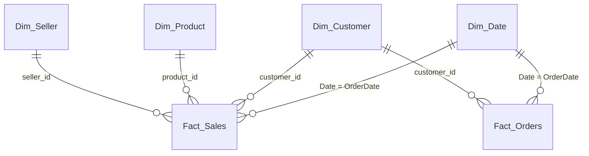

# Data model (Day 3)

## Design decision: two fact tables, not one

Your tracker says "one fact table". While building this you'll hit a real problem:
**delivery and review data belong to the order, but revenue belongs to the item.**
Put delivery days on the item table and an order with 3 items gets counted 3 times in
"average delivery days". Put revenue on the order table and you lose product and seller detail.

The standard fix is two fact tables at their natural grains, sharing the same dimensions
(a *fact constellation*). This is a strong interview answer, so understand it well.

| Table | Grain | Used for |
|---|---|---|
| Fact_Sales | one row per order item | revenue, items, categories, sellers |
| Fact_Orders | one row per order | delivery performance, reviews, payments |

A couple of order-level fields (`ReviewScore`, `IsLate`) are also copied onto Fact_Sales,
so you can show "average review by category". That's deliberate denormalisation; be ready
to explain it.

## Diagram

GitHub renders this Mermaid block as a diagram automatically. Also paste a screenshot
of your Power BI model view into the README.

## Tables and columns

**Fact_Sales** (from order items + order fields)
order_id, order_item_id, product_id, seller_id, customer_id, OrderDate, order_status,
price, freight_value, LineTotal, IsValidSale, IsLate, IsDelivered, ReviewScore

**Fact_Orders** (from orders + aggregated payments + latest review)
order_id, customer_id, OrderDate, order_status, order timestamps, PaymentValue,
MaxInstallments, MainPaymentType, ReviewScore, IsDelivered, DeliveryDays,
DaysVsEstimate, IsLate, IsValidOrder

**Dim_Customer**: customer_id (key), customer_unique_id, Customer City, Customer State,
Customer State Name, Customer Region, Customer Zip Prefix

**Dim_Product**: product_id (key), product_category_name, Category (English, tidy),
product_name_length, product_description_length, product_photos_qty, weight and size

**Dim_Seller**: seller_id (key), Seller City, Seller State, Seller State Name, Seller Region

**Dim_Date**: built in DAX (`dax/00_date_table.dax`), marked as date table

## Relationships (set these in Model view)

| From (one) | To (many) | Cardinality | Cross-filter |
|---|---|---|---|
| Dim_Date[Date] | Fact_Sales[OrderDate] | 1 : * | Single |
| Dim_Date[Date] | Fact_Orders[OrderDate] | 1 : * | Single |
| Dim_Customer[customer_id] | Fact_Sales[customer_id] | 1 : * | Single |
| Dim_Customer[customer_id] | Fact_Orders[customer_id] | 1 : * | Single |
| Dim_Product[product_id] | Fact_Sales[product_id] | 1 : * | Single |
| Dim_Seller[seller_id] | Fact_Sales[seller_id] | 1 : * | Single |

Do **not** relate Fact_Sales to Fact_Orders directly. Facts talk to each other only
through shared dimensions. That avoids ambiguous filter paths.

## Tidy-up checklist

- [ ] Mark Dim_Date as a date table (Table tools → Mark as date table)
- [ ] Hide every foreign key on the fact tables (users slice by dimension columns)
- [ ] Hide raw numeric columns once measures exist (users should use measures, not sums of columns)
- [ ] Sort `Month` by `Month No` and `Year Month` by `Year Month Sort`
- [ ] Set Customer State / Seller State data category to *State or Province* for maps
- [ ] Create an empty `_Measures` table (Enter data → one blank column, then hide the column)
- [ ] Confirm no many-to-many or bidirectional relationships exist
